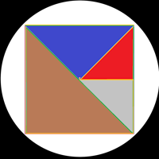

  
  <h1>
Mogul Network
</h1>
  <h3>$MGLN | The MglennP Ecosystem Official Hub</h3>

  

    
    
    
  

---

### 🛡️ Transparency & Security
Mogul Network (MGLN) is built on the philosophy of **"No Shenanigans."**

* **Verified Contract:** `0xC6bacc57cee87930bE22666A78FBb28718009A16`
* **Official Website:** [mgln.mglennp.com](https://mgln.mglennp.com)
* **Burn Proof 1:** [Transaction 0xeafad4...](https://basescan.org/tx/0xeafad4cdb64205e2b9c49795b955ecf43c35a6531df0fae8407e3578c59fff5a)
* **Burn Proof 2:** [Transaction 0xf6aa6f...](https://basescan.org/tx/0xf6aa6f9dc0a42bf0f256381bd8ed74779f6402ba5363785872a69f31cff2fc11)

---

### 🌐 The MglennP Ecosystem
*"An honest approach to solving everyday challenges."* — **Michael G. Pearson, Founder**

#### 📈 TrendDial
Algorithmic market sentiment analysis powered by MGLN. Features real-time data scraping and custom "MglennP Score" metrics for token holders.
> **Status:** Beta Integration

#### 🏠 Homestead Maintenance
Expert remodeling and custom stair building since 2007. Integrating MGLN for transparent maintenance logs and AI-driven project estimation.
> **Status:** [Visit Homestead](https://www.homesteadmaintenance.com)

---

### 🛠️ Developer Resources
- **Website Source:** Hosted on GitHub Pages via the `/docs` or root folder.
- **Language:** HTML/Tailwind CSS
- **Contact:** [mogul@mglennp.com](mailto:mogul@mglennp.com)

  
© 2026 Michael G. Pearson. All rights reserved.

